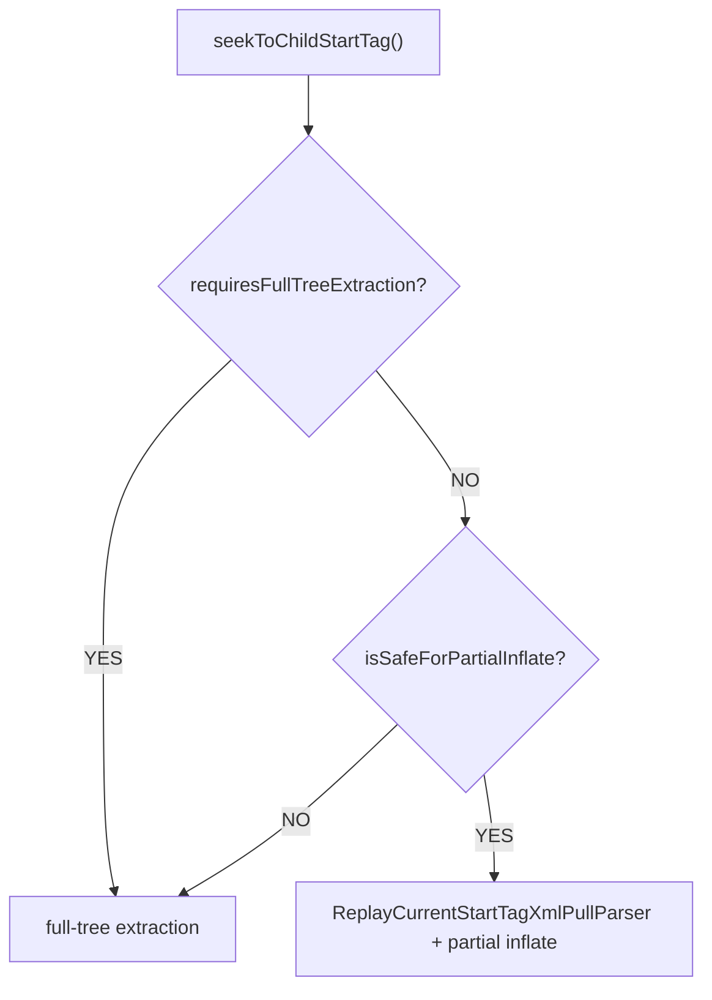

# FallbackInflater 局部 inflate 设计文档

## 概述

`FallbackInflater` 负责在生成代码无法等价覆盖某个布局或子树时，回到 Android 原生 `LayoutInflater`。根节点 fallback 可以直接 inflate 整个原始 layout；子树 fallback 则需要从原始 XML 中定位到目标子树，再只创建目标子树。

本文档定义 `FallbackInflater.inflateChild()` 的局部 inflate 方案，目标是在保持 Android 原生 inflate 语义的前提下，避免为了一个深层 fallback 节点创建整棵 View tree。

---

## 1. 问题背景

当前保守实现会先 inflate 整棵原始 layout，再按 `childPath` 找到目标节点并从父节点 detach：

```kotlin
val fullTree = inflater.inflate(layoutId, parent, false)
val child = findChildByPath(fullTree, childPath, layoutName)
(child.parent as? ViewGroup)?.removeView(child)
return child
```

这种方式语义安全，但成本较高。对于大型 layout，例如一个包含 100+ 个 View 的 `ConstraintLayout`，如果生成代码只需要 fallback 一个深层 `TextView`，运行时仍会创建整棵树，再摘取其中一个节点。

需要优化的场景：

- fallback 节点是普通 View 或普通 ViewGroup。
- `childPath` 能在原始 XML 中精确定位目标子树。
- 目标子树可以作为独立 XML root 交给 `LayoutInflater` 创建。

不应优化的场景：

- 目标节点是 `merge`、`include`、`fragment` 等依赖宿主 inflate 语义的特殊标签。
- fallback 是整个 root layout。
- XML 结构无法可靠定位目标子树。

---

## 2. 旧 parser partial inflate 的风险

Android framework 的 `LayoutInflater.inflate(XmlPullParser, root, attachToRoot)` 会先调用内部逻辑寻找 root start tag。以 Android 35 源码为例，入口会执行：

```java
advanceToRootNode(parser);
final String name = parser.getName();
```

`advanceToRootNode()` 会调用 `parser.next()`，直到遇到下一个 `START_TAG`。因此，如果外部代码已经把 parser 停在目标节点的 `START_TAG`，再直接传给 `LayoutInflater.inflate()`，framework 会跳过这个目标节点。

可能结果：

- 目标节点是叶子节点时，找不到下一个 `START_TAG`，inflate 失败。
- 目标节点是 ViewGroup 时，误把第一个子节点当作 root inflate。
- 返回 View 与 `childPath` 指向的目标不一致。

因此，不能把已经停在目标 `START_TAG` 的原始 parser 直接传给 `LayoutInflater.inflate()`。

---

## 3. 设计目标

1. 保持现有 `childPath` 合约不变。
2. 第一阶段只对白名单内的普通子树启用局部 inflate，不创建整棵原始 layout。
3. 继续使用 `Resources.getLayout()` 返回的 platform `XmlResourceParser`，保留 framework 属性解析能力。
4. `merge`、`include`、`fragment` 等特殊节点仍走 full-tree extraction。
5. DataBinding `<layout>` wrapper 下的子树路径仍从真实 View root 起算。
6. 不在白名单内的普通节点保持 full-tree extraction，优先保证语义正确性。
7. 错误路径输出可诊断信息，包括 layout 名称、path、当前位置和 child count。

---

## 4. 方案

### 4.1 总体流程

`inflateChild()` 使用原始 layout parser 定位目标节点。命中特殊节点或非白名单节点时走 full-tree extraction；命中白名单节点时，再通过一个只重放当前 `START_TAG` 的 parser wrapper 交给 Android `LayoutInflater`。

```kotlin
fun inflateChild(
    context: Context,
    @LayoutRes layoutId: Int,
    childPath: IntArray,
    parent: ViewGroup?
): View {
    val layoutName = context.resources.getResourceName(layoutId)
    val parser = context.resources.getLayout(layoutId)
    try {
        val targetTag = seekToChildStartTag(parser, childPath, layoutName)
        if (requiresFullTreeExtraction(targetTag)) {
            return inflateChildFromFullTree(context, layoutId, childPath, parent, layoutName)
        }
        if (!isSafeForPartialInflate(targetTag)) {
            return inflateChildFromFullTree(context, layoutId, childPath, parent, layoutName)
        }
        return LayoutInflater.from(context).inflate(
            ReplayCurrentStartTagXmlPullParser(parser),
            parent,
            false
        )
    } finally {
        parser.close()
    }
}
```

关键点：

- `seekToChildStartTag()` 返回时，原始 parser 位于目标 `START_TAG`。
- `requiresFullTreeExtraction()` 和 `isSafeForPartialInflate()` 共同决定是否启用局部 inflate。
- `ReplayCurrentStartTagXmlPullParser` 第一次 `next()` 返回当前 `START_TAG`，避免 framework 跳过目标节点。
- 第一次之后，所有事件继续委托给原始 parser。

### 4.2 Parser wrapper

`ReplayCurrentStartTagXmlPullParser` 只修正 `LayoutInflater` 对 `next()` 的入口预期，不重新实现 XML 属性解析。

行为要求：

- 构造时 parser 必须位于 `START_TAG`。
- 第一次调用 `next()` 时返回 `XmlPullParser.START_TAG`。
- 第一次之后调用原始 parser 的 `next()`。
- `getName()`、`getDepth()`、`getAttributeValue()`、`getAttributeCount()`、`getPositionDescription()` 等全部委托给原始 parser。

这样可以复用 platform `XmlResourceParser` 的属性读取结果，降低不同 Android 版本、AppCompat、自定义 View 属性读取的兼容风险。wrapper 仍不是原始 `XmlResourceParser` 实例，因此第一阶段只对白名单 tag 启用。

### 4.3 子树定位

定位逻辑保持 `childPath` 合约：

- 空 path 表示真实 View root。
- DataBinding `<layout>` 会先跳过 `<data>`，进入真实 View root。
- path 中每一项表示当前节点的直接子节点 index。
- index 只统计直接子 `START_TAG`，不会把孙节点算入当前层。

示例：

```xml
<LinearLayout>
  <TextView />
  <FrameLayout>
    <TextView />
  </FrameLayout>
</LinearLayout>
```

- `intArrayOf()` 指向 `LinearLayout`。
- `intArrayOf(0)` 指向第一个 `TextView`。
- `intArrayOf(1)` 指向 `FrameLayout`。
- `intArrayOf(1, 0)` 指向 `FrameLayout` 内部的 `TextView`。

### 4.4 特殊节点与安全白名单

#### 4.4.1 必须使用 full-tree extraction 的特殊节点

以下 tag 不做 partial inflate，继续 full-tree extraction：

```kotlin
private fun requiresFullTreeExtraction(tagName: String): Boolean {
    return tagName == "merge" || tagName == "include" || tagName == "fragment"
}
```

原因：

- `merge` 只能在有有效 parent 且 attachToRoot 为 `true` 时使用，不能作为普通 detached root。
- `include` 的 LayoutParams 覆盖和被 include layout 注入语义依赖父级 inflate 过程。
- `fragment` 涉及 FragmentFactory、FragmentManager 和宿主上下文，不适合作为独立子树 partial inflate。

#### 4.4.2 Partial inflate 安全白名单

由于 `ReplayCurrentStartTagXmlPullParser` wrapper 不是原始 `XmlResourceParser` 实例，存在类型检查和版本差异风险，第一阶段采用**保守白名单策略**：只对已验证安全的常见 Android 系统 View 使用 partial inflate。

```kotlin
private fun isSafeForPartialInflate(tagName: String): Boolean {
    return tagName in SAFE_PARTIAL_INFLATE_TAGS
}

private val SAFE_PARTIAL_INFLATE_TAGS = setOf(
    // 基础 View
    "View",
    "TextView",
    "ImageView",
    "Button",
    "EditText",

    // 常用布局容器
    "LinearLayout",
    "FrameLayout",
    "RelativeLayout",

    // 其他常见 widget
    "ImageButton",
    "CheckBox",
    "RadioButton",
    "ProgressBar",
    "SeekBar",
    "Switch",
    "Space"
)
```

**不在白名单内的 View（即使不是特殊节点）也会走 full-tree extraction**，包括：

- `ConstraintLayout`：目标 root 是 `ConstraintLayout` 时先保持 full-tree extraction；如果 fallback 目标是 `ConstraintLayout` 内部的白名单子节点，仍可对该子节点做局部 inflate。
- `RecyclerView`、`ViewPager`：复杂的 adapter 绑定
- 自定义 View：无法预测 inflate 行为
- AppCompat/Material Components：可能有特殊 inflate 逻辑
- 未知 tag：安全优先

白名单只检查目标 root tag，不递归检查目标子树内部的每个后代。原因是 Android `LayoutInflater` 原生会递归处理目标 root 下的 children；如果目标 root 本身在白名单内，该子树会整体交给原生 inflater。若后续测试发现某类后代组合存在风险，再从白名单移除对应 root tag，或在 analyzer 阶段阻止该子树进入 partial inflate。

#### 4.4.3 决策流程



```kotlin
fun inflateChild(...): View {
    val targetTag = seekToChildStartTag(parser, childPath, layoutName)

    // 步骤 1：检查特殊节点（merge/include/fragment）
    if (requiresFullTreeExtraction(targetTag)) {
        return inflateChildFromFullTree(...)
    }

    // 步骤 2：检查白名单
    if (!isSafeForPartialInflate(targetTag)) {
        // 不在白名单 -> 走 full-tree extraction
        return inflateChildFromFullTree(...)
    }

    // 步骤 3：白名单内的简单 View -> partial inflate
    return LayoutInflater.from(context).inflate(
        ReplayCurrentStartTagXmlPullParser(parser),
        parent, false
    )
}
```

#### 4.4.4 白名单扩展策略

初期保守，后续根据测试结果逐步扩展：

**Phase 1（初始版本）**：
- 只支持最基础的 View：`TextView`、`ImageView`、`View`、`Button`
- 只支持最简单的布局：`LinearLayout`、`FrameLayout`

**Phase 2（验证通过后）**：
- 扩展到 `RelativeLayout`
- 扩展到常见 widget：`EditText`、`CheckBox`、`ProgressBar` 等

**Phase 3（充分测试后）**：
- 考虑 `ConstraintLayout`（需特殊验证）
- 考虑 AppCompat widget：`AppCompatTextView` 等

**不推荐加入白名单**：
- 自定义 View（永远走 full-tree extraction）
- `RecyclerView`、`ViewPager`、`WebView` 等重量级组件

---

## 5. 多 sibling fallback

`inflateChildren()` 继续委托 `inflateChild()`：

```kotlin
fun inflateChildren(
    context: Context,
    @LayoutRes layoutId: Int,
    childPaths: Array<IntArray>,
    parent: ViewGroup?
): Array<View> {
    return Array(childPaths.size) { index ->
        inflateChild(context, layoutId, childPaths[index], parent)
    }
}
```

这个策略牺牲了一部分批量场景的 parser 复用，但有三个好处：

- 每个子树独立选择 partial inflate 或 full-tree extraction。
- 不会因为前一个 detach 改变后续 sibling index。
- 实现小，风险集中在 `inflateChild()`。

如果后续 benchmark 证明多 sibling fallback 成本明显，可以再引入「按 layout 共享 XML token 位置」或「特殊节点批量 full-tree extraction」优化。当前不作为第一阶段目标。

---

## 6. 测试计划

### 6.1 JVM 单元测试

覆盖纯定位逻辑和 wrapper 行为：

- 空 `childPath` 指向真实 View root。
- 直接子节点 index 定位正确。
- 深层 `childPath` 定位正确。
- 跳过 sibling subtree 后定位正确。
- negative index 抛出明确错误。
- out-of-bounds index 抛出明确错误。
- wrapper 第一次 `next()` 返回当前 `START_TAG`。
- wrapper 第二次及之后 `next()` 委托原始 parser。

### 6.2 Robolectric 或 Android runtime 测试

覆盖真实 `LayoutInflater` 行为：

- 深层叶子 `TextView` partial inflate 后返回目标 `TextView`。
- 普通 ViewGroup 子树 partial inflate 后保留完整 children。
- `parent` 不为空时，目标 root 生成正确的父级 `LayoutParams`。
- DataBinding `<layout>` wrapper 下，path 从真实 View root 起算。
- `merge`、`include`、`fragment` 命中特殊节点时走 full-tree extraction。
- 白名单 tag 走 partial inflate。
- 非白名单普通 tag 走 full-tree extraction。
- `ConstraintLayout` 作为目标 root 时按第一阶段策略回退 full-tree extraction。
- 白名单 ViewGroup 内含非白名单 child 时，按目标 root tag 决策并由原生 inflater 递归处理。

### 6.3 代码生成回归测试

保持以下生成代码不变：

- root fallback 仍调用 `FallbackInflater.inflate(...)`。
- 单个子树 fallback 仍调用 `FallbackInflater.inflateChild(...)`。
- 多 sibling fallback 仍调用 `FallbackInflater.inflateChildren(...)`。
- `childPath` 仍是完整路径，例如 `intArrayOf(1, 0)`，不退化为单层 index。

---

## 7. 验收标准

实现完成后应满足：

- 白名单内普通 fallback 子树不会 inflate 整棵原始 layout。
- 非白名单普通 fallback 子树保持 full-tree extraction。
- `LayoutInflater` 不会跳过目标节点。
- 特殊节点保持原有 full-tree extraction 语义。
- 生成代码 API 和 `childPath` 合约不变。
- DataBinding wrapper 下路径定位正确。
- `runtime`、`compiler-core`、`ksp-processor` 相关测试通过。

建议验证命令：

```bash
./gradlew :runtime:test :compiler-core:test :ksp-processor:test
```

如修改涉及 Android runtime 等价性测试，再补充 connected 或 Robolectric 验证命令。

---

## 8. 风险与边界

### 8.1 ReplayCurrentStartTagXmlPullParser 兼容性风险

风险：wrapper 不是原始 `XmlResourceParser` 实例，可能在以下场景失败：

**风险 1：类型检查**
```kotlin
// Framework 或自定义 View 可能做类型检查
if (parser is XmlBlock.Parser) {  // 内部实现类
    // 特殊处理路径
}
```
wrapper 会导致此分支失效，触发未测试的代码路径。

**风险 2：事件重放状态需要验证**
```kotlin
// wrapper 的入口行为：
getEventType()  // 返回 delegate 的 START_TAG
next()          // 第一次返回 START_TAG，但不调用 delegate.next()
```
第一次 `next()` 后，delegate 仍停在目标 `START_TAG`，这正是为了满足 `LayoutInflater.advanceToRootNode()` 的入口预期。需要通过测试确认 `getEventType()`、`getName()`、`getDepth()`、`getLineNumber()` 与 framework inflate 流程组合后行为一致。

**风险 3：Android 版本差异**
`XmlResourceParser` 在不同 Android 版本可能有新增方法，wrapper 需要在每个版本上测试。

**风险 4：第三方库特殊逻辑**
AppCompat、Material Components 等库可能有特殊的 inflate 逻辑依赖 parser 具体行为。

缓解：

- **采用保守白名单策略**：只对已验证安全的系统 View 使用 partial inflate（见 4.4.2）
- wrapper 不改属性读取、namespace、depth、position 等能力，全部委托给原始 parser
- 测试覆盖 framework 属性读取和父级 LayoutParams 生成
- 不在白名单内的 View（包括自定义 View、`ConstraintLayout`、`RecyclerView` 等）全部走 full-tree extraction
- 后续根据测试结果逐步扩展白名单

### 8.2 特殊语义遗漏

风险：白名单内仍可能存在不适合作为独立 root 的属性组合或子树组合。

缓解：

- 第一阶段只按已知高风险 tag 回退，并使用白名单限制 partial inflate 范围
- 通过 Android runtime 测试补充真实项目中出现的失败样例
- 新增失败样例时优先加入 `requiresFullTreeExtraction()` 或从白名单移除，或上游 analyzer fallback 规则

### 8.3 多 sibling 性能边界

风险：多个 fallback sibling 会多次打开 parser，多次 seek。

缓解：

- 相比旧方案，白名单内的普通 sibling 仍避免创建整棵 View tree。
- 先以单子树和白名单普通 sibling 为主要优化目标。
- 后续根据 benchmark 决定是否做批量定位优化。

---

## 9. 推荐落地顺序

1. 抽出 seek 逻辑的可测试单元，补齐非法 path 诊断测试。
2. 实现 `ReplayCurrentStartTagXmlPullParser`。
3. 实现 `requiresFullTreeExtraction()` 和 `isSafeForPartialInflate()` 的决策分支。
4. 将白名单内普通节点 partial inflate 改为 wrapper 方案。
5. 保留非白名单节点和 `merge/include/fragment` full-tree extraction。
6. 补 runtime 语义测试，证明目标节点没有被跳过，并覆盖白名单和非白名单分支。
7. 跑完整相关测试。
8. 如 benchmark 文档需要展示收益，再补一个大型 layout 的对比数据。
